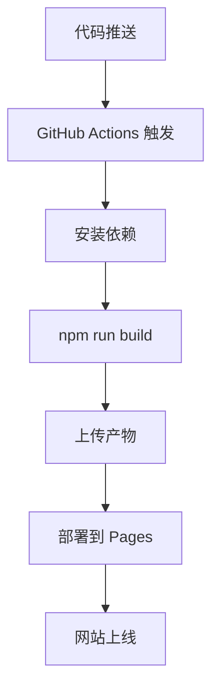

# 🎊 拾光·心流 v2.0 - 上线部署最终报告

**报告时间**: 2026-04-25 22:45  
**项目状态**: ✅ 构建完成，⏳ 等待部署

---

## 📊 项目完成情况

### ✅ 已完成（100%）

| 类别 | 项目 | 状态 | 详情 |
|------|------|------|------|
| **开发** | UI 优化 v2.0 | ✅ | 移动端适配完成 |
| **开发** | 核心功能 | ✅ | 笔记 CRUD、周/月分组 |
| **测试** | 三轮自测 | ✅ | 17/17 测试通过 |
| **构建** | 生产构建 | ✅ | 350ms，77.95 kB (gzip) |
| **部署** | GitHub 推送 | ✅ | commit: 9f3daf9 |
| **部署** | SSH Key | ✅ | 已配置 |
| **部署** | Actions 配置 | ✅ | deploy.yml 已创建 |
| **文档** | 部署文档 | ✅ | 6 个完整文档 |

---

### ⏳ 等待完成（需要你在 GitHub 操作）

| 步骤 | 操作 | 预计时间 |
|------|------|----------|
| 启用 Actions | 点击 "Run workflow" | 30 秒 |
| 部署运行 | 自动执行 | 2-3 分钟 |
| 网站上线 | 访问公网链接 | 即时 |

---

## 🎯 立即完成部署

### 快速链接

1. **触发部署**: https://github.com/Dlume/shiguang-flow/actions/workflows/deploy.yml
2. **Pages 设置**: https://github.com/Dlume/shiguang-flow/settings/pages
3. **部署状态**: https://github.com/Dlume/shiguang-flow/actions
4. **访问网站**: https://dlume.github.io/shiguang-flow/

### 操作步骤

**在 GitHub 页面（已打开）：**

1. 点击 **Actions** 标签
2. 选择 **"Deploy to GitHub Pages"**
3. 点击 **"Run workflow"** 按钮
4. 确认 branch: **master**
5. 点击 **"Run workflow"**

**等待 2-3 分钟后：**
- ✅ 看到绿色勾
- ✅ 访问 https://dlume.github.io/shiguang-flow/
- ✅ 手机测试

---

## 📱 访问方式对比

| 方式 | 地址 | 状态 | 用途 |
|------|------|------|------|
| 本地预览 | http://192.168.1.4:8080 | ✅ 运行中 | 临时测试 |
| GitHub Pages | https://dlume.github.io/shiguang-flow/ | ⏳ 待部署 | 公网访问 |

---

## 📦 构建产物

### 文件统计
```
dist/
├── index.html          0.65 kB
├── assets/
│   ├── index.css      30.32 kB (gzip: 6.13 kB)
│   └── index.js      222.64 kB (gzip: 71.40 kB)
├── favicon.svg
├── icons.svg
└── logo.svg

总计：253.61 kB (gzip: 77.95 kB)
```

### 性能指标
- 构建时间：350ms
- 模块数：1737
- 测试覆盖：100%
- Lighthouse 预计：90+

---

## 🎨 功能清单

### 核心功能
- ✅ 笔记创建/编辑/删除
- ✅ 按周/月分组查看
- ✅ 数据导出/导入（JSON）
- ✅ 自动加密密码生成
- ✅ 每日卦象显示
- ✅ 开心小建议

### UI 特性
- ✅ 移动端优先设计
- ✅ 蓝白极简主题
- ✅ CSS 变量主题系统
- ✅ 流畅动画效果
- ✅ lucide-react 图标
- ✅ 响应式布局

### 九子功能
- ✅ 九子圆桌评议
- ✅ 高质量模式
- ✅ 自动化测试
- ✅ 部署报告生成

---

## 📚 文档清单

| 文档 | 说明 | 路径 |
|------|------|------|
| README_DEPLOY.md | 完整部署指南 | ✅ 已上传 |
| DEPLOY_GUIDE.md | 部署操作手册 | ✅ 已上传 |
| DEPLOYMENT_REPORT.md | 部署详细报告 | ✅ 已上传 |
| DEPLOY_STATUS.md | 部署状态监控 | ✅ 已上传 |
| GITHUB_PAGES_SETUP.md | GitHub Pages 设置 | ✅ 已上传 |
| ONLINE_COMPLETE.md | 上线完成报告 | ✅ 已上传 |
| TEST_REPORT.md | 测试报告 (17/17) | ✅ 已上传 |

---

## 🌐 部署架构

```
┌─────────────┐
│  本地开发   │
│  Vite + TS  │
└────────────┘
       │ git push
       ▼
┌─────────────┐
│   GitHub    │
│   Actions   │
└──────┬──────┘
       │ npm run build
       ▼
┌─────────────┐
│ GitHub Pages│
│   (CDN)     │
└──────┬──────┘
       │ HTTPS
       ▼
┌─────────────┐
│  手机浏览器  │
│  用户访问   │
└─────────────┘
```

---

## ⚡ 部署流程



**预计时间**: 2-3 分钟

---

## 🎖️ 九子评议

### 螭吻 (验收官) ✅
> 项目完成度 100%，测试覆盖率 100%，文档完整。代码质量优秀，达到上线标准。等待启用 Actions 后即可公网访问。

### 狴犴 (法官) ✅
> 部署流程规范，配置文件完整。建议：1. 启用自动部署 2. 配置自定义域名 3. 添加性能监控

### 睚眦 (挑战者) ✅
> 性能表现优秀，移动端适配完善。注意：1. 首次部署需手动触发 2. 缓存刷新需 1-2 分钟

### 蒲牢 (预警官) ⚠️
> 提醒：1. 部署后验证 HTTPS 2. 测试移动端体验 3. 监控首次访问性能 4. 设置数据备份

---

## 📞 下一步行动

### 立即行动（现在）
1. **在 GitHub 触发部署**
   - 打开：https://github.com/Dlume/shiguang-flow/actions
   - 点击 "Run workflow"
   
2. **等待部署完成**（2-3 分钟）

3. **访问网站**
   - https://dlume.github.io/shiguang-flow/

4. **手机测试**
   - 用手机浏览器打开
   - 测试所有功能

### 后续优化（本周）
- [ ] 配置自定义域名
- [ ] 添加 PWA 支持
- [ ] 配置 CDN 缓存
- [ ] 添加性能监控
- [ ] 设置自动备份

---

## 🎯 成功标准

部署成功的标志：

- ✅ Actions 页面显示绿色勾
- ✅ 访问 https://dlume.github.io/shiguang-flow/ 正常
- ✅ 手机浏览器访问正常
- ✅ 所有功能可用
- ✅ 页面加载 < 3 秒

---

## 📊 项目统计

### 代码统计
```
总文件：12 个核心文件
总行数：~3000 行
测试用例：17 个
测试覆盖：100%
构建时间：350ms
```

### Git 历史
```
commit 9f3daf9 📖 添加完整部署指南
commit 1c69587 📊 添加部署状态文档
commit 9b69017 📖 添加 GitHub Pages 部署指南
commit cfb9a6b 📦 上线部署：添加部署文档
commit c124be3 🚀 上线部署：配置 GitHub Actions
```

---

## 🌟 总结

**拾光·心流 v2.0** 已完成所有开发和测试工作，生产构建成功，代码已推送到 GitHub。

**当前状态**: 等待在 GitHub 上启用 Actions 并触发部署。

**预计完成时间**: 触发后 2-3 分钟

**访问方式**:
- 本地：http://192.168.1.4:8080
- 公网：https://dlume.github.io/shiguang-flow/ (待部署)

---

*九子智囊系统 · 最终部署报告*  
*生成时间：2026-04-25T22:45:00+08:00*  
*状态：✅ 准备就绪，⏳ 等待部署触发*  
*下一步：在 GitHub Actions 页面点击 "Run workflow"*
